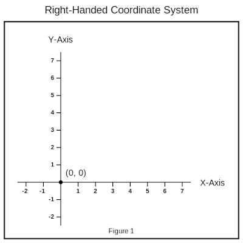
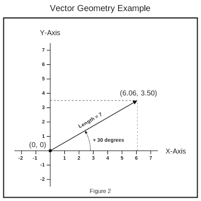

# Project Description

**A Tkinter DrawArea wrapper class for the pycairo package.**

Add words here ...

anti-aliasing

rgba color - opacity channel

PyOpenGL - measures angles in degrees. Angles increase in the counter-clockwise direction.

Unlike either the Tkinter Canvas widget or the pycairo package, the **DrawArea** widget class operates in a standard, right-handed coordinate system. This means that the y-axis values increase from the bottom of the display to the top of the display. This is illustrated in Figure 1.



This package adds a fully compatible **DrawArea** widget to Tkinter's set of graphical user interface widgets, thereby providing the user with a convenient tool for working with the pycairo package in any Tkinter window based application.

<div class="page"/>

# Installation

```
pip install pycairotk
```

# Overview

This package provides the following class definitions **:**

* **DrawArea -** A Tkinter widget class for displaying an OpenCV image
* **BorderStyle -** A data class of the available border style options
* **Brush -** A data class of graphics rendering options
* **Font -** A data class for describing a text font
* **TextStyle -** A data class of text rendering options
* **Shape -** An enumerated class of available datapoint shapes
* **LineCap -** An enumerated class of available line endpoint options
* **LineJoin -** An enumerated class of available line junction options
* **Antialias -** An enumerated class of available rendering options
* **Size -** A named tuple class of the width and height dimensions of an object
* **Vector -** A class which represents a geometric vector in the xy plane

Add words here ...

<div class="page"/>

## Parameter Information

### Color Parameters

The **Brush** and **TextStyle** classes allow the user to specify the color that is used by the **DrawArea** graphics and text rendering methods. Unlike pycairo, where the color is specified by its individual component values, the pycairotk package allows the user to specify the color in a wide variety of forms and formats.

A color parameter value can be provided in one of the following forms **:**

* It can be expressed as a named color string, e.g. **'white'**. A defined set of named colors can be found at **:** [CSS Color 4: Named Colors](https://drafts.csswg.org/css-color-4/#named-colors)
* It can be expressed as a 6-digit hexadecimal notation color string **'#rrggbb'**
* It can be expressed as a 8-digit hexadecimal notation color string **'#rrggbbaa'**
* It can be expressed as a tuple color value **( red, green, blue [, alpha] )** that conforms to one of these formats **:**
    * 3 or 4 integer color components, each ranging in value from 0 to 255
    * 3 or 4 floating point color components, each ranging in value from 0.0 to 1.0

### Location Parameters

All the **DrawArea** graphics and text rendering methods require the user to specify either one or two locations. All locations are given in units of pixels. A location value consists of an ordered pair of numbers, namely the **x-coordinate value** and the **y-coordinate value.**, with the **y-coordinate value** increasing from the bottom of the display to the top of the display (a right-handed coordinate system).

A location parameter value can be provided in one of the following forms **:**

* It can be expressed as a two element tuple **( x-coordinate, y-coordinate )**
* It can be expressed as a **Vector** value

### Size Parameters

Both the **ellipse** and **rectangle** graphics rendering methods require the user to specify the dimensions (or size) of the rendered object. The dimensions are given in units of pixels.

A size parameter value can be provided in one of the following forms **:**

* It can be expressed as a two element tuple **( width, height )**
* It can be expressed as a **Size** value

### Angle Parameters

The **Vector** class, the **TextStyle** class, and several of the **DrawArea** graphics rendering methods all involve the use of angle values, with the angle given in units of degrees. The angle value increases in the counter-clockwise direction, which conforms with the **DrawArea** rendering methods operating in a standard, right-handed coordinate system.

<div class="page"/>

# Documentation

## DrawArea

### DrawArea( *parent, width, height [, antialias]* )

Constructs and initializes the graphics drawing area.

* ***parent* : Any -** The parent widget of the DrawArea.

* ***width* : int -** The width of the graphics drawing area (in pixels).

* ***height* : int -** The height of the graphics drawing area (in pixels).

* ***antialias* : Antialias, optional -** The type of antialiasing used for rendering text or shapes. **defaults to Antialias.DEFAULT**

By default, the **border_style** property is set to **BorderStyle.Flat**, and the **origin (0, 0)** is located in the lower-left corner.

### Properties

* **border_style : str -** The border style of the DrawArea. This property can be set to any one of the available BorderStyle options **( e.g. BorderStyle.Ridge )**. ( read / write )

* **cursor : str -** The cursor style for the DrawArea **( e.g. 'crosshair'** ). ( read / write )

* **origin : tuple -** The location of the origin in the graphics drawing area (in pixels). ( read / write)

* **width : int -** The width of the graphics drawing area (in pixels). ( readonly )

* **height : int -** The height of the graphics drawing area (in pixels). ( readonly )

### Methods

* **clear() -** Clear all graphics objects from the drawing area.

* **display() -** Display all the currently defined graphics objects.

* **save( *filename* ) -** Save the currently displayed graphics image to a file.  This method returns **True** if the image was successfully saved, **False** otherwise.

    * ***filename* : str -** The full filename of the image file.

* **set_background( *color* ) -** Set the background color of the DrawArea.

    * ***color* : str | tuple -** The specified background color (the alpha component is ignored).

<div class="page"/>

* **arc( *brush, radius, start, end* ) -** Draw a circular arc segment from the start point to the end point.

    * ***brush* : Brush -** The specified graphics rendering options.
    * ***radius* : float -**  : The arc radius (in pixels), negative denotes a clockwise direction.
    * ***start* : Vector | tuple -** The start point coordinates (in pixels).
    * ***end* : Vector | tuple -** The end point coordinate (in pixels).

* **arrow( *brush, location, angle* ) -** Draw a standard 3:1 ratio arrowhead at the specified location. The length of the arrowhead equals: **3 * max( 6.0, 4 * brush.width )**. This method returns the coordinates of the center of the arrowhead's base (in pixels)

    * ***brush* : Brush -** The specified graphics rendering options.
    * ***location* : Vector | tuple -** The location coordinates of the arrowhead's tip (in pixels).
    * ***angle* : float -** The direction angle of the arrowhead (measured in degrees).

* **circle( *brush, center, radius* ) -** Draw a circle of specified radius, centered on the given location.

    * ***brush* : Brush -** The specified graphics rendering options.
    * ***center* : Vector | tuple -** The center location coordinates (in pixels).
    * ***radius* : float -** The specified radius of the circle (in pixels).

* **datapoint( *brush, center [, shape]* ) -** Draw a datapoint centered at the given location.

    * ***brush* : Brush -** The specified graphics rendering options.
    * ***center* : Vector | tuple -** The center location coordinates (in pixels).
    * ***shape* : Shape, optional -** The specified datapoint shape. **defaults to Shape.CIRCLE**

* **ellipse( *brush, center, size [, angle]* ) -** Draw an ellipse of given dimensions, centered on the given location.

    * ***brush* : Brush -** The specified graphics rendering options.
    * ***center* : Vector | tuple -** The center location coordinates (in pixels).
    * ***size* : Size | tuple -** The width and height dimensions of the ellipse (in pixels).
    * ***angle* : float, optional -** The rotation angle of the ellipse (measured in degrees). **defaults to 0.0**

* **label( *style, start, text* ) -** Draw a text label at the starting location. This method returns the dimensions of the rendered text string (in pixels).

    * ***style* : TextStyle -** The specified text rendering options.
    * ***start* : Vector | tuple -** The starting location coordinates (in pixels).
    * ***text* : str -** The text string to display

* **line( *brush, start, end* ) -** Draw a straight line segment from the start point to the end point.

    * ***brush* : Brush -** The specified graphics rendering options.
    * ***start* : Vector | tuple -** The start point coordinates (in pixels).
    * ***end* : Vector | tuple -** The end point coordinate (in pixels).

<div class="page"/>

* **polygon( *brush, coords, segments* ) -** Draw an enclosed region as defined by the coordinates and segments.

    * ***brush* : Brush -** The specified graphics rendering options.
    * ***coords* : list[Vector] | list[tuple] -** The list of the coordinates that define the polygon.
    * ***segments* : list[int] | list[float], optional -** The list of segment radii. **defaults to straight line segments**

    The polygon's perimeter path endpoint is always joined to **coords[0].**

    By default, the segments parameter is set to **None**, which results in a perimeter path composed of all line segments. When the segments parameter is set to a list of radii values, each radius value is rendered as follows:

    * A radius value > 0 draws a counter-clockwise circular arc segment.
    * A radius value < 0 draws a clockwise circular arc segment.
    * A radius value == 0 draws a line segment.

    **Important :** When not **None**, the number of segments must equal the number of coordinates.

* **rectangle( *brush, start, size* ) -** Draw a rectangle with the given dimensions at the starting location.

    * ***brush* : Brush -** The specified graphics rendering options.
    * ***start* : Vector | tuple -** The starting location coordinates (in pixels).
    * ***size* : Size | tuple -** The width and height dimensions of the rectangle (in pixels).

* **square( *brush, center, side [, angle]* ) -** Draw a square of given side length, centered on the given location.

    * ***brush* : Brush -** The specified graphics rendering options.
    * ***center* : Vector | tuple -** The center location coordinates (in pixels).
    * ***side* : float -** The side length of the square (in pixels).
    * ***angle* : float, optional -** The rotation angle of the square (measured in degrees). **defaults to 0.0**

### User Notes

The **DrawArea** widget is derived from the Tkinter Label widget. This means that the **DrawArea** inherits all of the Universal Tkinter widget methods, and that all of these methods are available to the user. This also means that all of the Label widget's options are exposed to the user. To avoid the possibility of creating any unpredictable **DrawArea** behavior, the user should never directly modify the values of the underlying Label widget's options. The one exception to this "hands-off rule" is that the user can safely modify the widget's **'state'** value.

<div class="page"/>

## Antialias

**These constants specify the type of antialiasing to do when rendering text or shapes.**

* **DEFAULT -** Use the default antialiasing for the subsystem and target device.

* **NONE -** Use a bilevel alpha mask.

* **GRAY -** Perform single-color antialiasing (using shades of gray for black text on a white background, for example).

* **SUBPIXEL -** Perform antialiasing by taking advantage of the order of subpixel elements on devices such as LCD panels.

* **FAST -** Hint that the backend should perform some antialiasing but prefer speed over quality.

* **GOOD -** The backend should balance quality against performance.

* **BEST -** Hint that the backend should render at the highest quality, sacrificing speed if necessary.

## BorderStyle

**These are the available border style options for the DrawArea.**

* **Raised -** The DrawArea appears raised above the background.

* **Sunken -** The DrawArea appears recessed into the background.

* **Groove -** The DrawArea has a carved groove border.

* **Ridge -** The DrawArea has a raised ridge border.

* **Solid -** The DrawArea has a simple solid border.

* **Flat -** The DrawArea appears flat, no border.

## Shape

**These are the available datapoint shape options.**

* **CIRCLE -** The datapoint is drawn as a circular dot.

* **DIAMOND -** The datapoint is drawn as a diamond

* **SQUARE -** The datapoint is drawn as a square.

* **TRIANGLE -** The datapoint is drawn as an upward pointing triangle.

<div class="page"/>

## Brush

**The graphics rendering options data class.**

### Brush( *[width] [, color] [, fill] [, edge] [ ,dash] [, line_cap] [, line_join]* )

### Attributes

* **width : float, optional -** The displayed line/arc segment width or the datapoint size. **defaults to 1.0**

* **color : str | tuple, optional -** The line/arc segment, perimeter, or the solid fill color. **defaults to 'black'**

* **fill : bool, optional -** If True, the polygon is filled with solid color. **defaults to False**

* **edge : str | tuple, optional -** The perimeter color of the solid filled polygon. **defaults to no color**

* **dash : list | tuple, optional -** The dash pattern of the line/arc segment. **defaults to a solid line**

* **line_cap : LineCap, optional -** The shape of a line/arc segment's endpoints. **defaults to LineCap.BUTT**

* **line_join : LineJoin, optional -** The polygon's perimeter joining style. **defaults to LineJoin.MITER**

### Methods

* **copy( *[width] [, color] [, fill]* ) -** Returns a deep copy of the brush with optional new width, color, and/or fill values.
    * ***width* : float, optional -** The new width assigned to the copy. **defaults to the current width**
    * ***color* : str | tuple, optional -** The new color assigned to the copy. **defaults to the current color**
    * ***fill* : bool, optional -** The new fill value assigned to the copy. **defaults to the current fill**

## LineCap

**These constants specify how to render the endpoints of a line segment.**

* **BUTT -** The line segment ends exactly at each endpoint.

* **ROUND -** The line segment includes a circle centered on each endpoint.

* **SQUARE -** The line segment includes a square centered on each endpoint.

## LineJoin

**These constants specify how to render the junction of two line segments.**

* **BEVEL -** The join is a flat facet drawn at the mid-angle between the line segments.

* **MITER -** The join is a sharp corner formed by continuing the line edges until they meet.

* **ROUND -** The join is a circle centered on the point where the line segments meet.

<div class="page"/>

## Font

**The text font description data class.**

### Font( *[family] [, height] [, bold] [, italic]* )

### Attributes

* **family : str, optional -** The font family name as a string. **defaults to 'Arial'**

* **height : float, optional -** The font height (in pixels). **defaults to 12.0**

* **bold : bool, optional -** Boldface text if True, otherwise normal text. **defaults to False**

* **italic : bool, optional -** Italic text if True, otherwise upright text. **defaults to False**

## TextStyle

**The text rendering options data class.**

### TextStyle( *[font] [, color] [, anchor] [, angle] [, border]* )

### Attributes

* **font : Font, optional -** The font of the displayed text. **defaults to Font()**

* **color : str | tuple, optional -** The color of the displayed text. **defaults to 'black'**

* **anchor : str, optional -** The anchor point of the displayed text. **defaults to tk.LEFT**

* **angle : float, optional -** The orientation angle of the displayed text (measured in degrees). **defaults to 0.0**

* **border : float, optional -** A positive value displays outlined text. **defaults to -1.0**

## Size

**A named tuple class which provides the width and height dimensions of an object.**

### Size( *width, height* )

Constructs the named tuple class from the object's x-axis and y-axis dimensions.

* ***width* : float -** The x-axis dimension of the object.
* ***height* : float -** The y-axis dimension of the object.

### Properties

* **width : float -** The x-axis dimension of the object. ( readonly )
* **height : float -** The y-axis dimension of the object. ( readonly )

<div class="page"/>

## Vector

**A class which represents a geometric vector in the xy plane.**

### Vector( *x, y* )

Constructs a new Vector from the x-axis and y-axis vector components.

* ***x* : float -** The x-axis component of the vector.
* ***y* : float -** The y-axis component of the vector.

### Vector.from_polar_coords( *length, angle* )

Constructs a new Vector using polar coordinate values.

* ***length* : float -** The length (or magnitude) of the vector.
* ***angle* : float -** The angle (or direction) of the vector w.r.t. the x-axis (measured in degrees).

```
    # Create a position vector using polar coordinate values
    vector = Vector.from_polar_coords(7, 30)
    print(f'({vector.x :0.2f}, {vector.y :0.2f})')  # Output: (6.06, 3.50)
```
The resulting position vector is illustrated in Figure 2.



<div class="page"/>

### Attributes

* **x : float -** The x-axis component of the vector. ( read / write )
* **y : float -** The x-axis component of the vector. ( read / write )

### Properties

* **length : float -** The magnitude (or length) of the vector. ( readonly )
* **angle : float -** The direction (or angle) of the vector w.r.t. the x-axis (measured in degrees). ( readonly )

### Methods

* **rotated( *angle* ) -** Returns a copy of the vector rotated by the specified angle.
    * **angle : float -** The specified rotation angle (measured in degrees).

### Operators

The following operations are supported by the Vector class :

* **Vector Addition :**

```
    vector_c = vector_a + vector_b
    vector_a += vector_b
```

* **Vector Subtraction :**

```
    vector_c = vector_a - vector_b
    vector_a -= vector_b
```

* **Scalar Multiplication :**

```
    vector_b = scalar * vector_a
    vector_b = vector_a * scalar
    vector_a *= scalar
```

* **Scalar Division :**

```
    vector_b = vector_a / scalar
    vector_a /= scalar
```

<div class="page"/>

* **Unary Plus & Unary Minus :**

```
    vector_b = +vector_a
    vector_b = -vector_a
```

* **Checking Equality :**

```
    boolean = vector_a == vector_b
    boolean = vector_a != vector_b
```

* **The Inner (or Dot) Product :**

```
    scalar = vector_a @ vector_b
```

* **The Outer (or Cross) Product :**

```
    scalar = vector_a ^ vector_b
```

### Miscellaneous

* **A vector can be indexed just like a two element tuple :**

```
    # The x-axis component can be accessed as vector[0]
    # The y-axis component can be accessed as vector[1]
    # The len() function returns the number of vector components

    vector = Vector(3, 4)
    a, b = vector  # Assigns: a = 3, b = 4
    print(len(vector))  # Output: 2
```

* **The abs() function returns the magnitude (or length) of a vector :**

```
    vector = Vector(3, 4)
    print(abs(vector))  # Output: 5.0
    print(vector.length)  # Output: 5.0
```

<div class="page"/>

# Pycairotk Example

```
import tkinter as tk
from pycairotk import DrawArea, Brush, Font, TextStyle, Vector


class DemoWindow(tk.Frame):
    """The pycairotk graphics demonstration window."""

    def __init__(self, master):
        """Construct and draw the pycairotk graphics example."""
        super().__init__(master)
        master.title('Pycairotk Example')
        self._draw = DrawArea(self, 600, 450)
        self._draw.grid()
        self.grid()

        # Draw a simple pie-chart
        radius = 150
        color_names = ('red', 'yellow', 'skyblue')
        inc = 360 / len(color_names)
        line = Vector(0, radius)
        middle = 0.6 * line.rotated(inc / 2)
        brush = Brush(2, fill=True, edge='black')
        text_style = TextStyle(Font(height=20, bold=True), anchor=tk.CENTER)
        self._draw.origin = (self._draw.width / 2, self._draw.height / 2)
        for i, color in enumerate(color_names):
            pnts = [(0, 0), line.rotated(i * inc), line.rotated((i + 1) * inc)]
            segments = [0, radius, 0]  # segments = [line, arc, line]
            self._draw.polygon(brush.copy(color=color), pnts, segments)
            self._draw.label(text_style, middle.rotated(i * inc), color)

        self._draw.display()  # This should always be the last statement


# Execute the script
if __name__ == '__main__':
    main_form = DemoWindow(tk.Tk())
    main_form.mainloop()
```